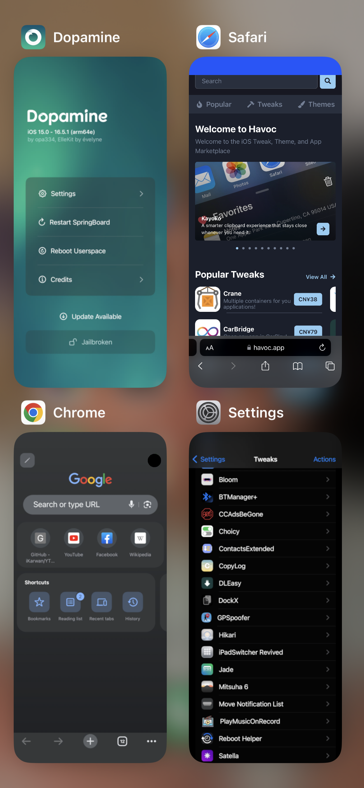
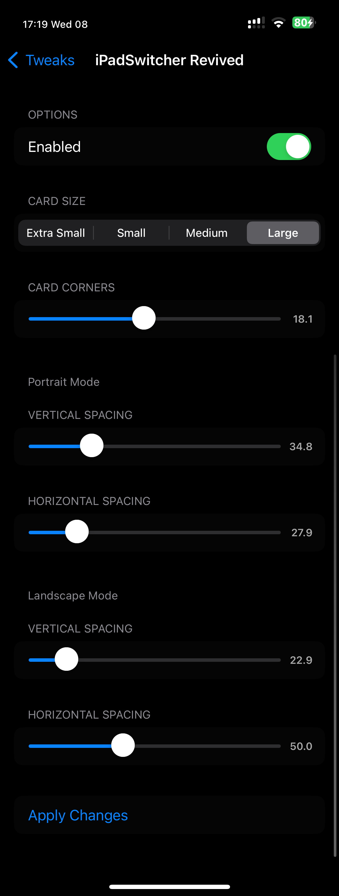

# iPadSwitcher Revived

iPad-style grid app switcher for iPhone on iOS 16 rootless jailbreaks.

Based on the original **iPadSwitcher** by mali9510 (2020). The iOS 16
implementation is a ground-up rewrite: instead of forcing the layout, it makes
SpringBoard build its own native iPad grid switcher, so it's smooth and artifact-free —
with adjustable card size, spacing, and corner radius.

## Features
- Native iPad-style grid switcher on iPhone
- Card size presets (Extra Small → Large)
- Vertical / horizontal spacing controls (portrait + landscape)
- Corner radius control
- Settings apply live — no respring needed for most changes

## How it works
The original tweak forced the iPad switcher style, which broke on modern iOS. This version
instead makes SpringBoard construct its own native iPad switcher (scoped to switcher
construction), then adjusts card size, spacing and corner radius through the settings the
grid actually reads — so every part (cards, snapshots, labels, corners) stays coherent.

## Compatibility
- **iOS 16** (tested on 16.5, Dopamine). Not supported on iOS 15 — the switcher internals
  changed significantly between 15 and 16, and this build targets the iOS 16 path.
- arm64 / arm64e

## Credits
- Original **iPadSwitcher** by **mali9510** — https://github.com/mali9510/iPadSwitcher
- iOS 16 rewrite / rootless revival by **schlub51**

## License
MIT — see [LICENSE](LICENSE). Original © 2020 mali9510.
